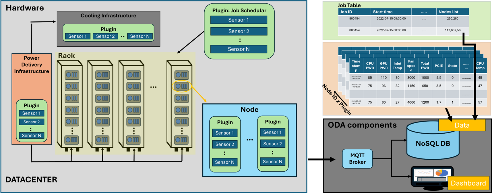
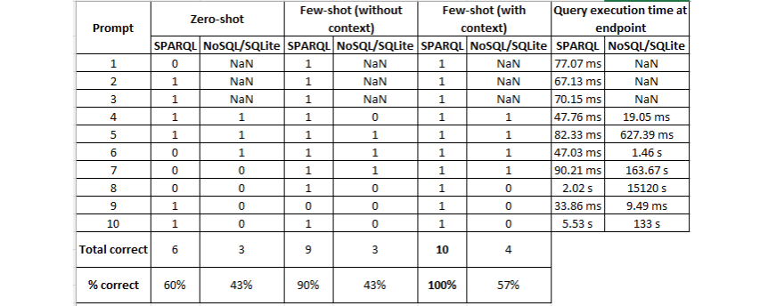

# LLM agent for Data Centers
Project for the Knowledge engineering course at UNIBO by **Junaid Ahmed Khan**.

Collaborators: **Prof. Andrea Bartolini** (Supervisor) and **Martin Molan**.

## Introduction
Data centers have become essential to support the massive computational requirements of large language models (LLMs). As demand grows, so does the need for scalability in these data centers. However, with greater scalability comes increased complexity in managing such facilities. For example, CINECA’s Leonardo supercomputer consists of approximately 5,000 compute nodes and millions of sensors, all within a single facility. To address these challenges, data centers rely on Operational Data Analytics (ODA) practices, which provide insights to streamline management and ensure efficient performance at scale.

Operational Data Analytics (ODA) consists of two main components:

1. **Collection of Telemetry Data**: This involves gathering detailed telemetry data from the facility, including metrics from compute nodes, sensors, and other critical infrastructure.

2. **Monitoring Framework**: This component focuses on analyzing the collected data and providing visualizations to support informed decision-making and ensure efficient facility management.
The following figure outlines the typical data center facility with ODA:

## Problem Statement
Current approaches in data center and HPC data monitoring typically rely on NoSQL databases due to their scalability and ability to handle diverse data sources. However, this approach often results in telemetry data lacking a defined structure and relationships between different data sources. The absence of a clear structure requires domain knowledge of both the data center infrastructure and the collected data to manage it effectively. Furthermore, variability in data management practices across different data centers adds another layer of complexity to data analysis and interpretation.

The components within a data center and their associated data sources inherently demonstrate relationships. For example, there is a direct connection between a submitted job and the compute node it utilizes. To address these challenges and leverage these relationships, we can encode the domain knowledge of data centers using a knowledge graph. This approach allows us to model and understand the intricate relationships between data sources, enabling more efficient data management and analysis.

## Ontology for ODA
We developed the following ontology for ODA, which will serve as the schema for our Knowledge Graph.

## Dataset: ExaData
The ExaData is an open-access dataset that covers 31 months of data collected from the Marconi100 (M100) supercomputer at CINECA. The data is gathered using the ODA monitoring framework called Examon. It includes data from 980 compute nodes, aggregating information from various sources such as job tables, sensor data, and log files. The collected data is stored in a NoSQL database (Cassandra) with a time-series extension (KairosDB). In total, 573 metrics are collected, and the dataset amounts to 49TB of data. This makes it the largest public dataset of its kind within the supercomputing and data center community.

The dataset can be accessed at the following nature article link: https://www.nature.com/articles/s41597-023-02174-3
For our experiments, we utilized one month of real, in-production data from May 2022.

## LLM agent

The following figure outlines the proposed workflow:

The user submits a prompt in natural language, which is then combined with the proposed ODA ontology and a set of few-shot examples to construct the input prompt for the LLM agent. The ODA ontology provides the LLM with the schema of the knowledge graph, while the few-shot examples guide the LLM in generating proper SPARQL queries for ODA. These generated queries are passed to the SPARQL endpoint of a graph database containing the knowledge graph built with the M100 dataset. The query is executed at the endpoint, and the response is returned to the user’s input prompt. 

## Experimental Evaluation

To evaluate the LLM agent, we tested its ability to generate NoSQL/SQLite query code, which is the default method for querying data center ODA data. We created a list of ten archetype input prompts that a facility manager would regularly use. These archetype prompts are listed below:

| **No.** | **Archetype Prompt**                                                                        |
|---------|---------------------------------------------------------------------------------------------|
| 1       | Give me all the nodes present in rack 1                                                     |
| 2       | Give me a list of all the racks                                                             |
| 3       | Give me the position of node 3                                                              |
| 4       | Give me the list of plugins                                                                 |
| 5       | What nodes were used by the job 1001282?                                                    |
| 6       | What is the average power used by the job 1000882?                                          |
| 7       | How many jobs are running on node 5 during the month of May 2022?                           |
| 8       | What is the min, max, and avg temperature of node 5 when it is in use during May 2022?      |
| 9       | Give me a list of sensors which are of type "power"                                         |
| 10      | Give me a list of the jobs running and the nodes they used during the month of May 2022     |

These ten archetype queries are complex, as they require a facility manager or engineer to run multiple subqueries to generate the final desired response. For example, for archetype prompt number 6, the default NoSQL/SQLite ODA practice would involve first querying the job data from the job table. Using this data, the nodes utilized by the specified job ID would be identified. Then, another NoSQL/SQLite query would be needed to query the power metric table and retrieve the average power consumption during the job's duration on the identified nodes.

In contrast, with the proposed workflow, the relationships between different data sources are already established in the ODA knowledge graph, with the schema defined by the ontology. This simplifies querying, making it more efficient than the default NoSQL/SQLite ODA practices.

### Results

The following table outlines the results of the experiments conducted to evaluate the proposed workflow. We tested three different prompting techniques: (1) Zero-shot (with context), (2) Few-shot (without context), (3) Few-shot (with context).

